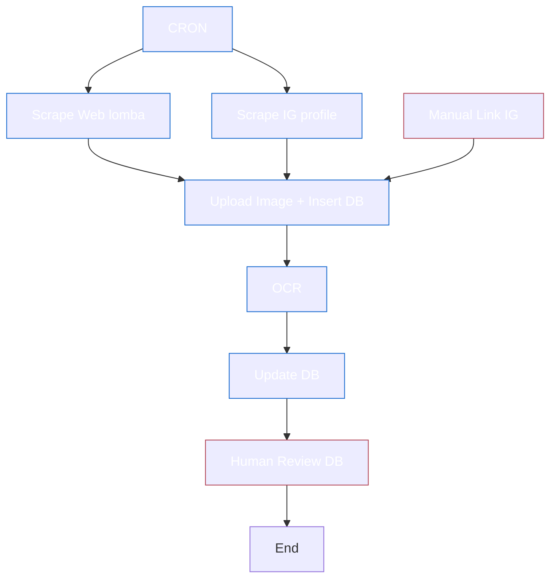
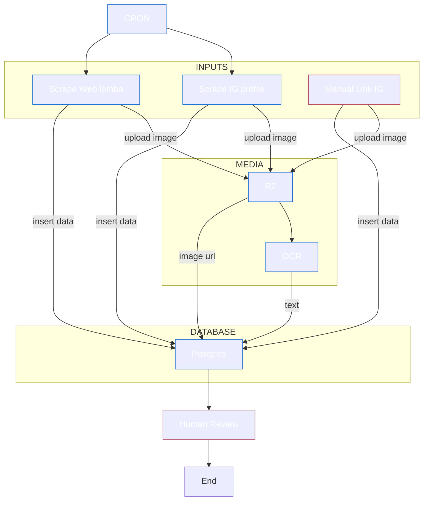

## Tech stack

- crawlee, cheerio
- @aduptive/instagram-scraper
- postgresql
- r2 bucket
- mistral ocr
- cloudflare workflows

## Data scrape

web: gambar, 
ig: gambar, caption, url instagram, instagram profile

## Alur simple

## Alur kompleks

