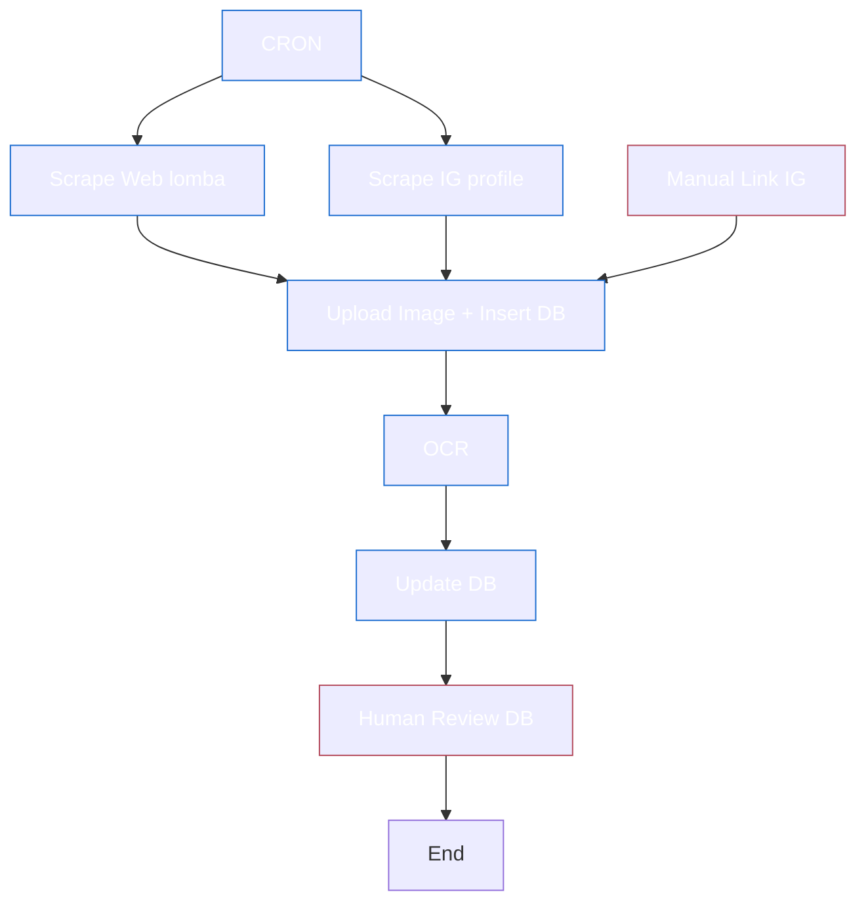
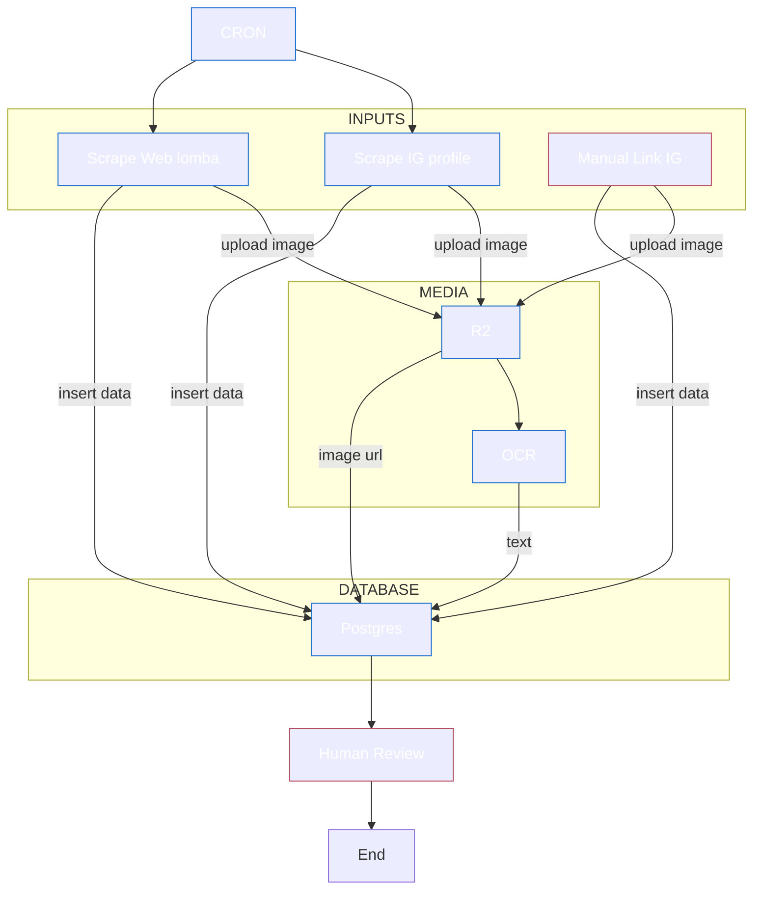

## Tech stack

- crawlee, cheerio
- @aduptive/instagram-scraper
- postgresql
- r2 bucket
- zai ai
- mistral ocr
- cloudflare workflows

rules:

## Data scrape

web: gambar, 
ig: gambar, caption, url instagram, instagram profile

## Alur simple

## Alur kompleks

## Yg perlu diperhatikan
- Ini adalah sistem workflow automasi yang scrapping informasi lomba dari web dan instagram untuk kemudian disimpan ke dalam r2 bucket cloudflare dan database postgres yang telah didefinisikan schemanya, nantinya data tersebut akan digunakan untuk broadcasting dan sebagai database aplikasi katalog lomba
- Admin panel digunakan untuk mengecek dan mengupdate database postgres, yang CRUD nya juga dikorelasikan dengan cloudflare r2, mengirim pesan ke channel WA
- **Output log console**: Menampilkan sumber scraping (Web/IG), proses upload R2, status extraction, dan update database
- CRON berjalan setiap **6 jam sekali**
- **Mekanisme data extraction**: 2-step process
  1. Text AI (Zai) extract dari caption/description → dapat structured data
  2. Image AI (Mistral OCR) extract field yang kosong dari poster → fallback ke Gemini kalau gagal
  3. Update ke database **streaming** (langsung setelah tiap record selesai, bukan batch)
- **Mekanisme deduplication**: Cek URL Instagram dan Web. Jika URL sudah ada:
  - Cek apakah data AI sudah diekstrak (field organizer, startDate, endDate, categories, level)
  - Kalau belum diekstrak → lanjut proses extraction
  - Kalau sudah lengkap → skip
- **Mekanisme IG scrape retry**: Jika error 401 (rate limit), tunggu 5 menit dan retry terus sampai berhasil (max 10x percobaan)
- **TODO - Mekanisme edit gambar**: Perlu ditambahkan supaya gambar tidak sama dengan data di Instagram (hindari duplicate detection)
- **Human review**: Diperlukan untuk:
  - Cek lomba duplikat
  - Verifikasi informasi lomba sudah benar atau belum
  - Kirim info ke WhatsApp channel
- **WhatsApp notification**: Notif tiap data baru dikirim ke grup WA (currently disabled, siap diaktifkan)
- web scrape dan ig scrape berjalan paralel
- ig scrape terkadang gagal, maka diterapkan perulangan dengan delay 5 menit dan terulang terus menerus hingga proses berhasil
